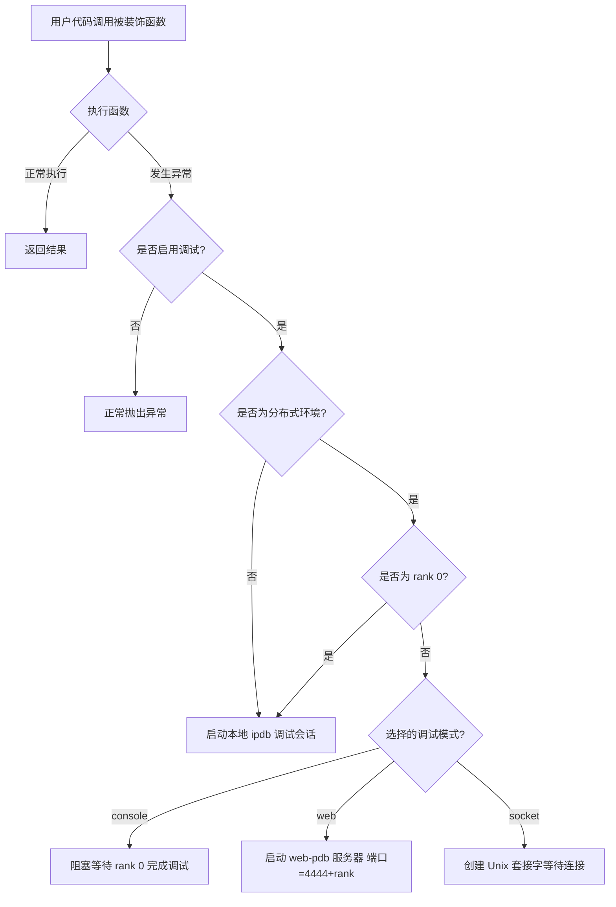

# Python Debugging Utilities

# Python Debugging Utilities - 改进版

## 应用背景与挑战

在复杂 Python 应用开发中，特别是分布式和多进程环境下，调试往往面临以下挑战：

- **常规调试器局限**：传统调试方法如 `pdb` 在分布式环境下难以使用，尤其是 PyTorch 多进程场景
- **异常现场丢失**：程序崩溃时，关键上下文信息常常丢失，导致根因分析困难
- **远程调试障碍**：服务器环境中进行实时调试需要特殊工具支持
- **多进程冲突**：多个进程同时使用调试器时会发生 stdin/stdout 冲突

`py_debug` 工具专为解决这些挑战而设计，尤其适合 PyTorch 分布式训练等复杂环境中的调试需求。

## 核心功能与特点

`py_debug` 提供了一种非侵入式的异常调试机制，具有以下核心特性：

- **装饰器自动捕获**：通过 `@Debugger.attach_on_error()` 装饰器，无需修改代码逻辑即可在异常发生位置启动调试器
- **异常现场保护**：完整保留异常发生时的调用栈、变量状态和上下文信息
- **分布式调试协调**：自动协调多进程环境中的调试流程，避免 stdin/stdout 竞争冲突
- **多种调试接口**：支持控制台、Web 和 Socket 三种调试方式，适应不同环境需求
- **环境感知**：自动检测运行环境（单进程/多进程）和进程角色（rank），采取相应的调试策略

## 适用场景

1. **PyTorch 分布式训练调试**：解决多 GPU 训练时难以定位的随机错误和数据异常
   ```python
   @Debugger.attach_on_error()
   def train_epoch(model, dataloader):
       # 训练代码，在任何 rank 上出错时都能自动启动适当的调试器
   ```

2. **复杂算法开发**：在数据处理管道、模型结构设计过程中快速定位逻辑错误
   ```python
   @Debugger.attach_on_error()
   def process_complex_data(data):
       # 复杂数据处理逻辑
   ```

3. **环境问题排查**：临时开启调试模式定位难以复现的生产问题
   ```bash
   # 不需要修改代码，通过环境变量临时启用调试
   export IPDB_DEBUG=1
   python production_service.py
   ```

4. **远程服务器调试**：在无 GUI 服务器环境中进行有效调试
   ```bash
   # 在一个会话中启动应用
   export IPDB_DEBUG=1
   export IPDB_MODE=socket
   python server_app.py
   
   # 在另一个会话中连接调试器
   nc -U /tmp/pdb.sock.0
   ```

## 安装方法

```shell
git clone https://github.com/hhqx/py3_tools.git
cd py3_tools
pip install -e .[py_debug]
```

## 详细使用指南

### 1. 基础用法 - 添加调试装饰器

```python
from py3_tools.py_debug import Debugger

@Debugger.attach_on_error()
def my_function():
    # 任何可能出错的代码
    result = complex_calculation()
    return process_result(result)
```

当 `my_function` 内部发生异常时，如果启用了调试模式（通过环境变量 `IPDB_DEBUG=1` 或代码中设置 `Debugger.debug_flag = True`），调试器会自动在异常发生位置启动。

### 2. 分布式 PyTorch 环境调试

```python
import torch.distributed as dist
from py3_tools.py_debug import Debugger

# 初始化分布式环境
dist.init_process_group(backend='nccl')
rank = dist.get_rank()

@Debugger.attach_on_error()
def distributed_training():
    # 分布式训练代码
    model = create_model()
    for batch in dataloader:
        # 训练逻辑，任何 rank 上的异常都会被捕获并启动调试
        outputs = model(batch)
```

在分布式环境中，系统会自动检测每个进程的 rank，并采用相应的调试策略：
- **rank 0** 默认使用交互式控制台调试
- **其他 rank** 根据 `debug_mode` 设置使用 web 调试器或 socket 调试器

### 3. 调试模式选择

```bash
# 控制台模式（适合单机开发）
export IPDB_MODE=console

# Web 模式（适合远程服务器通过浏览器调试）
export IPDB_MODE=web

# Socket 模式（适合无 GUI 环境）
export IPDB_MODE=socket
```

### 4. 命令行参数控制

```python
import argparse
from py3_tools.py_debug import Debugger

parser = argparse.ArgumentParser()
parser.add_argument('--debug', action='store_true')
parser.add_argument('--debug_mode', choices=['console', 'web', 'socket'])
args = parser.parse_args()

if args.debug:
    Debugger.debug_flag = True
if args.debug_mode:
    Debugger.debug_mode = args.debug_mode
```

## 工作原理

`py_debug` 工具基于装饰器模式，在异常发生时动态启动适当的调试器：

1. **异常捕获**：装饰器拦截被装饰函数中的异常
2. **环境检测**：确定当前是否为分布式环境，获取进程 rank
3. **调试器选择**：根据环境和配置选择合适的调试方式
4. **现场保护**：保留完整的异常上下文和调用栈
5. **调试协调**：在多进程环境中协调不同进程的调试行为

### 调试流程图



## 调试实例

### 单进程调试示例
```bash
# 启用调试并运行
export IPDB_DEBUG=1
python examples/py_debug/debug_single_process.py --mode error
```

### 分布式调试示例
```bash
# 启用 socket 调试模式，运行 3 个进程，让 rank 1 产生错误
export IPDB_DEBUG=1
export IPDB_MODE=socket
torchrun --nnodes=1 --nproc_per_node=3 examples/py_debug/debug_multi_torch_rank.py --fail_ranks 1

# 在另一终端连接到 rank 1 的调试器
nc -U /tmp/pdb.sock.1
```

通过这种方式，`py_debug` 提供了一个强大而灵活的调试解决方案，特别适合分布式和多进程 Python 应用，显著提升开发效率和问题排查能力。

## 核心功能

`py_debug` 是一个的 Python 调试工具，专为解决 Python 应用中的异常捕获与实时调试而设计。它可以：

- **保护异常现场**：在异常发生时，自动捕获并保存完整的调用栈和上下文
- **动态接入调试器**：无需修改代码，通过环境变量动态开启调试模式
- **分布式调试支持**：针对 PyTorch 分布式应用提供特殊支持，区分处理不同 rank 进程
- **多种调试模式**：支持控制台(console)、网页(web)和套接字(socket)三种调试接口
- **简洁易用**：通过简单的装饰器和环境变量，即可接入强大的调试功能

## 使用场景

1. **开发调试阶段**：在开发新功能时，快速定位和排查错误
2. **生产环境故障排查**：通过设置环境变量，临时开启调试模式排查问题
3. **分布式应用调试**：解决多进程分布式应用（如 PyTorch 分布式训练）中的调试难题
4. **远程服务器调试**：使用 Web 或 Socket 调试接口，远程连接到服务器进程进行调试

## Install
```shell
git clone https://github.com/hhqx/py3_tools.git
cd py3_tools
pip install -e .[py_debug]
```

## 快速上手

### 1. 装饰器使用方式

使用 `@Debugger.attach_on_error()` 装饰可能出错的函数，在异常发生时自动进入调试模式：

```python
from py3_tools.py_debug import Debugger

@Debugger.attach_on_error()
def my_function():
    x = 10
    y = 0
    return x / y  # 这里会触发 ZeroDivisionError
```

### 2. 通过环境变量启用调试

无需修改代码，通过环境变量动态控制是否开启调试：

```bash
# 开启调试模式
export IPDB_DEBUG=1

# 选择调试模式：console(默认), web, socket
export IPDB_MODE=console

# 运行程序
python your_script.py
```

### 3. 分布式应用调试

在 PyTorch 分布式环境中，不同 rank 使用不同的调试方式：

```python
import torch.distributed as dist
from py3_tools.py_debug import Debugger

dist.init_process_group(backend='nccl')
rank = dist.get_rank()

@Debugger.attach_on_error()
def process_data():
    if rank == 1:
        # rank 1 会触发错误，自动启动调试器
        x = [1, 2, 3][10]  # 索引越界错误
    return "Success"
```

### 4. 上下文异常调试

可以使用 try/except 块和 Debugger 方法来调试特定代码块：

```python
from py3_tools.py_debug import Debugger
import sys

def risky_function():
    try:
        print("执行风险操作...")
        result = 1 / 0
        return result
    except Exception as e:
        if Debugger.debug_flag:
            print(f"捕获到异常: {e}")
            _, tb = sys.exc_info()[1], sys.exc_info()[2]
            Debugger.blocking_console_post_mortem(rank=0)
        else:
            raise
```

## 详细使用说明

### 单进程调试

装饰任何可能出错的函数，当异常发生并且 `IPDB_DEBUG=1` 时，将自动在异常位置进入调试会话：

```python
from py3_tools.py_debug import Debugger

# 通过命令行参数启用调试
import argparse
parser = argparse.ArgumentParser()
parser.add_argument('--debug', action='store_true')
parser.add_argument('--debug_mode', choices=['console', 'web', 'socket'])
args = parser.parse_args()

if args.debug:
    Debugger.debug_flag = True
if args.debug_mode:
    Debugger.debug_mode = args.debug_mode

@Debugger.attach_on_error()
def complex_calculation():
    # 一些可能出错的代码
    result = process_data()
    return analyze_result(result)
```

### 分布式 PyTorch 调试

针对分布式训练，系统会自动处理不同 rank 的调试方式：

```python
@Debugger.attach_on_error()
def train_epoch(model, dataloader):
    for batch in dataloader:
        outputs = model(batch)
        loss = compute_loss(outputs)
        loss.backward()
        # 如果这里出现错误，根据 debug_mode 和 rank 不同采取不同调试方式:
        # - console 模式: rank 0 直接在控制台调试，其他 rank 暂停等待
        # - web 模式: 每个 rank 在端口 4444+rank 启动 web-pdb 服务器
        # - socket 模式: 每个 rank 创建 Unix 套接字等待调试客户端连接
```

### 调试模式说明

系统支持三种调试模式，可通过环境变量 `IPDB_MODE` 或代码中设置 `Debugger.debug_mode` 来选择：

1. **console**: 
   - rank 0 使用标准控制台调试，其他 rank 暂停等待
   - 适合单机开发调试

2. **web**:
   - 每个 rank 启动独立的 web-pdb 服务器
   - 服务器端口: `4444 + rank` 
   - 通过浏览器访问 `http://hostname:port/` 进行调试
   - 适合远程开发环境

3. **socket (默认)**:
   - 每个 rank 创建 Unix 套接字 `/tmp/pdb.sock.{rank}`
   - 调试客户端可通过 `nc -U /tmp/pdb.sock.{rank}` 或 `socat - UNIX-CONNECT:/tmp/pdb.sock.{rank}` 连接
   - 适合无 GUI 环境或需要自定义调试客户端的场景

## 实现细节
1. **异常捕获机制**：
   - 使用装饰器拦截函数执行过程中的异常。
   - 检查调试模式是否开启（环境变量或标志）。
   - 获取异常信息和调用栈，准备调试环境。

2. **调试器启动逻辑**：
   - 单进程：直接使用 `ipdb.post_mortem()` 在异常位置启动交互式调试。
   - 多进程：根据 rank 和 debug_mode 决定调试方式：
     - console 模式: rank 0 使用 ipdb，其他 rank 阻塞等待
     - web 模式: 所有 rank 启动 web-pdb 服务器在不同端口
     - socket 模式: 所有 rank 创建 Unix 套接字等待连接

3. **环境变量控制**：
   - 通过 `IPDB_DEBUG=1` 开启调试模式。
   - 通过 `IPDB_MODE=[console|web|socket]` 选择调试模式。
   - 可通过命令行参数覆盖环境变量设置。

## 示例脚本
### 单进程调试脚本
[debug_single_process.py](debug_single_process.py): 演示各种单进程调试场景。
```shell
# 基本用法
export IPDB_DEBUG=1
python examples/py_debug/debug_single_process.py --mode error

# 使用上下文管理器进行调试
python examples/py_debug/debug_single_process.py --mode context --debug

# 使用 web 模式调试
export IPDB_MODE=web
python examples/py_debug/debug_single_process.py --mode math_error --debug
```

### 分布式调试脚本
[debug_multi_torch_rank.py](debug_multi_torch_rank.py): 演示不同错误类型和调试模式的分布式调试。
```shell
# 基本用法（默认 console 模式）
export IPDB_DEBUG=1
torchrun --nnodes=1 --nproc_per_node=3 examples/py_debug/debug_multi_torch_rank.py --fail_ranks 0 2

# 使用 socket 模式调试
export IPDB_DEBUG=1
export IPDB_MODE=socket
torchrun --nnodes=1 --nproc_per_node=3 examples/py_debug/debug_multi_torch_rank.py --fail_ranks 1
# 在另一个终端中：nc -U /tmp/pdb.sock.1

# 测试不同类型的错误
torchrun --nnodes=1 --nproc_per_node=2 examples/py_debug/debug_multi_torch_rank.py --fail_ranks 0 --error_type zerodivision --debug
```

## 注意事项
- **分布式调试**：
  - `console` 模式: 只有 `rank 0` 进行交互式调试，其他 rank 暂停等待。
  - `web` 模式: 各 rank 在端口 `4444 + rank` 启动独立服务器。
  - `socket` 模式: 各 rank 创建套接字 `/tmp/pdb.sock.{rank}` 等待连接。
- **环境变量**：
  - `IPDB_DEBUG=1`: 启用调试功能。
  - `IPDB_MODE=[console|web|socket]`: 设置调试模式。
  - 使用 `torchrun` 时需设置正确的分布式环境。
- **调试客户端**：
  - Socket 模式推荐使用 `nc -U /tmp/pdb.sock.{rank}` 或 `socat - UNIX-CONNECT:/tmp/pdb.sock.{rank}` 连接。

### 3. 实现机制

- **装饰器模式**: `@Debugger.attach_on_error()` 拦截函数执行并捕获异常
- **环境检测**: 通过环境变量 `IPDB_DEBUG` 或命令行参数 `--debug` 启用调试
- **分布式感知**: 检测 PyTorch 分布式环境并获取当前进程的 rank
- **异常现场保护**: 保留完整调用栈和变量信息，不丢失异常上下文
- **多种调试界面**: 
  - console 模式: rank 0 使用标准 ipdb 交互调试，其他 rank 等待
  - web 模式: 使用 web-pdb 提供 Web 界面，便于远程调试
  - socket 模式: 创建 Unix 套接字，允许任意客户端连接，最大灵活性
