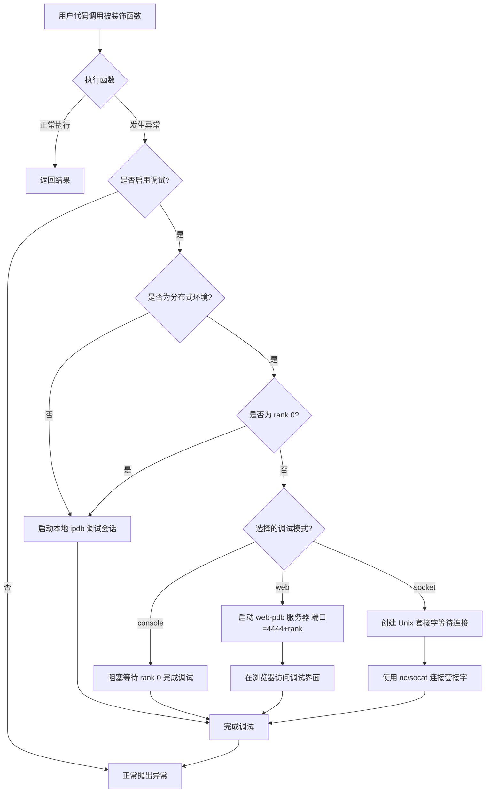
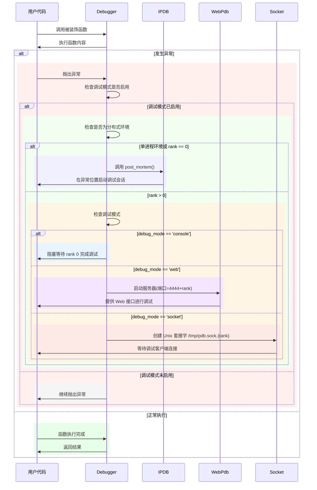

# Python Debugging Utilities

`py_debug` 是一个专为复杂 Python 应用，尤其是分布式和多进程环境设计的高效调试工具。通过简单的装饰器和环境变量，轻松实现实时调试和异常捕获。

---

## 核心功能

* **自动异常捕获**：使用 `@Debugger.attach_on_error()` 装饰器，无需手动捕获异常。
* **完整现场保存**：异常发生时，完整保留调用栈、变量状态和上下文信息。
* **多进程协调**：自动处理多进程环境中的 stdin/stdout 冲突。
* **灵活的调试接口**：提供控制台、Web 和 Socket 接口，适应各种调试需求。
* **智能环境检测**：自动识别单进程或分布式环境，智能选择调试策略。

---

## 安装方式
1. 从源码安装
    ```shell
    git clone https://github.com/hhqx/py3_tools.git
    cd py3_tools
    pip install -e .[py_debug]
    ```
2. 从 pip 源安装
    ```shell
    pip install py3_tools_hqx
    ```

---

## 快速入门

### 1. 基础用法：装饰器调试
添加装饰器后，函数内部发生异常时，会自动启动调试器。

**示例脚本 `your_script.py`**：
```python
from py3_tools.py_debug import Debugger

@Debugger.attach_on_error()
def risky_operation():
    # 任何可能抛异常的逻辑
    result = 1 / 0

if __name__ == "__main__":
    risky_operation()
```

**设置环境变量，启动调试器：**
```bash
export IPDB_DEBUG=1
export IPDB_MODE=console
python your_script.py
```

**输出结果：**
```
2023-07-15 10:24:32 - INFO - py_debug.debug_utils - Registering risky_operation for debug on error, using `export IPDB_DEBUG=1` to enable debugger auto attach when error occurs.
2023-07-15 10:24:32 - ERROR - py_debug.debug_utils - Exception caught in risky_operation:
Traceback (most recent call last):
  File "/path/to/py3_tools/py_debug/debug_utils.py", line 273, in debuggable_function_wrapper
    return target_function(*args, **kwargs)
  File "your_script.py", line 6, in risky_operation
    result = 1 / 0
ZeroDivisionError: division by zero
2023-07-15 10:24:32 - INFO - py_debug.debug_utils - Entering ipdb post_mortem debugger...

> your_script.py(6)risky_operation()
      5     # 任何可能抛异常的逻辑
----> 6     result = 1 / 0
      7 

ipdb> p locals()
{'result': <undefined>}
ipdb> p globals().keys()
dict_keys(['__name__', '__doc__', '__package__', '__loader__', '__spec__', '__file__', '__cached__', '__builtins__', 'Debugger', 'risky_operation'])
ipdb> q  # 退出调试器
```

* 调试器启动在异常发生的精确行（`result = 1 / 0`）
* 可以检查局部变量、全局变量等上下文信息
* 支持标准的 pdb/ipdb 调试命令


### 2. 环境变量控制

#### 参数说明

| 环境变量         | 默认值      | 功能说明                             |
| ------------ | -------- | -------------------------------- |
| `IPDB_DEBUG` | `0`      | 是否启用调试（`1` 为启用）                  |
| `IPDB_MODE`  | `socket` | 调试模式，可选 `console`/`web`/`socket` |

#### 使用方式
```bash
export IPDB_DEBUG=1
export IPDB_MODE=web
python your_script.py
```

**Web模式输出结果：**
```
2023-07-15 10:35:18 - INFO - py_debug.debug_utils - Registering risky_operation for debug on error, using `export IPDB_DEBUG=1` to enable debugger auto attach when error occurs.
2023-07-15 10:35:18 - ERROR - py_debug.debug_utils - Exception caught in risky_operation:
Traceback (most recent call last):
  File "/path/to/py3_tools/py_debug/debug_utils.py", line 273, in debuggable_function_wrapper
    return target_function(*args, **kwargs)
  File "your_script.py", line 6, in risky_operation
    result = 1 / 0
ZeroDivisionError: division by zero
2023-07-15 10:35:18 - INFO - py_debug.debug_utils - Starting WebPdb post_mortem server on port 4444...
2023-07-15 10:35:18 - INFO - py_debug.debug_utils - Open http://0.0.0.0:4444/ in browser to debug.
```


### 3. 分布式调试

适用于 PyTorch 多 GPU 训练。

1. 示例脚本 `distributed_example.py`：

    ```python
    import torch.distributed as dist
    from py3_tools.py_debug import Debugger
    import argparse
    
    parser = argparse.ArgumentParser()
    parser.add_argument('--debug', action='store_true', help='Enable debugging')
    args = parser.parse_args()
    
    if args.debug:
        Debugger.debug_flag = True
    
    backend = 'gloo'  # 或 'nccl'，根据实际情况选择
    dist.init_process_group(backend=backend)
    rank = dist.get_rank()
    world_size = dist.get_world_size()
    
    @Debugger.attach_on_error()
    def train_step():
        print(f"Process rank {rank} of {world_size} running train_step()")
        # rank 1 强制出错演示
        if rank == 1:
            print(f"Rank {rank} about to raise an error")
            raise RuntimeError(f"模拟错误在进程 rank {rank}")
        return "OK"
    
    if __name__ == '__main__':
        print(f"Starting process with rank {rank}")
        train_step()
        print(f"Rank {rank} completed successfully")
    ```

2. 启动调试器和输出结果：

    ```bash
    export IPDB_DEBUG=1
    export IPDB_MODE=socket
    torchrun --nnodes=1 --nproc_per_node=3 distributed_example.py
    ```

    **进程 0 (Rank 0) 输出:**
    ```
    2023-07-15 11:04:22 - [rank:0] INFO - __main__ - Starting process with rank 0
    2023-07-15 11:04:22 - [rank:0] INFO - py_debug.debug_utils - Registering train_step for debug on error, using `export IPDB_DEBUG=1` to enable debugger auto attach when error occurs.
    Process rank 0 of 3 running train_step()
    2023-07-15 11:04:23 - [rank:0] INFO - __main__ - Rank 0 completed successfully
    ```

    **进程 1 (Rank 1) 输出:**
    ```
    2023-07-15 11:04:22 - [rank:1] INFO - __main__ - Starting process with rank 1
    2023-07-15 11:04:22 - [rank:1] INFO - py_debug.debug_utils - Registering train_step for debug on error, using `export IPDB_DEBUG=1` to enable debugger auto attach when error occurs.
    Process rank 1 of 3 running train_step()
    Rank 1 about to raise an error
    2023-07-15 11:04:23 - [rank:1] ERROR - py_debug.debug_utils - Exception caught in train_step:
    Traceback (most recent call last):
      File "/path/to/py3_tools/py_debug/debug_utils.py", line 273, in debuggable_function_wrapper
        return target_function(*args, **kwargs)
      File "distributed_example.py", line 22, in train_step
        raise RuntimeError(f"模拟错误在进程 rank {rank}")
    RuntimeError: 模拟错误在进程 rank 1
    2023-07-15 11:04:23 - [rank:1] INFO - py_debug.debug_utils - Starting socket-based debugging for rank 1...
    2023-07-15 11:04:23 - [rank:1] ERROR - py_debug.debug_utils - Error occurred at [rank:1]: 'RuntimeError(模拟错误在进程 rank 1)'
    2023-07-15 11:04:23 - [rank:1] INFO - py_debug.debug_utils - Waiting for debugger client to connect on /tmp/pdb.sock.1, use 'nc -U /tmp/pdb.sock.1' to connect to the debugger.
    ```

    **进程 2 (Rank 2) 输出:**
    ```
    2023-07-15 11:04:22 - [rank:2] INFO - __main__ - Starting process with rank 2
    2023-07-15 11:04:22 - [rank:2] INFO - py_debug.debug_utils - Registering train_step for debug on error, using `export IPDB_DEBUG=1` to enable debugger auto attach when error occurs.
    Process rank 2 of 3 running train_step()
    2023-07-15 11:04:23 - [rank:2] INFO - __main__ - Rank 2 completed successfully
    ```

3. 在另一个终端连接到 Rank 1 的调试器:

    ```bash
    nc -U /tmp/pdb.sock.1
    ```

    **连接后的调试会话:**
    ```
    2023-07-15 11:04:30 - [rank:1] INFO - py_debug.debug_utils - Debugger client connected
    2023-07-15 11:04:30 - [rank:1] INFO - py_debug.debug_utils - Connection established on /tmp/pdb.sock.1
    
    > distributed_example.py(22)train_step()
         21             print(f"Rank {rank} about to raise an error")
    ---> 22             raise RuntimeError(f"模拟错误在进程 rank {rank}")
         23         return "OK"
    
    (rank-1-pdb) p rank
    1
    (rank-1-pdb) p world_size
    3
    (rank-1-pdb) p locals()
    {'rank': 1, 'world_size': 3}
    (rank-1-pdb) q
    ```

### 调试模式选择

| 模式      | 使用场景          | 特点                          | 使用方法                           |
| ------- | ------------- | --------------------------- | ------------------------------ |
| console | 单机开发          | rank 0 直接控制台交互，其他 rank 阻塞等待 | 直接在程序运行终端交互                    |
| web     | 远程服务器开发       | 每个 rank 独立端口 Web 界面调试       | 浏览器访问 http://hostname:4444+rank/ |
| socket  | 无 GUI 或自定义客户端 | 每个 rank 创建 Unix 套接字等待连接     | 使用 `nc -U /tmp/pdb.sock.{rank}` 连接 |

环境变量配置：

```bash
export IPDB_MODE=socket
```

## 最佳实践

* 推荐在开发和测试环境中使用 `console` 或 `web` 模式。
* 在生产环境或无 GUI 场景使用 `socket` 模式。
* 对于复杂代码，可使用装饰器对特定函数进行保护：

```python
@Debugger.attach_on_error()
def most_complex_function():
    # 只对这个函数启用自动调试
    ...
```

### 单进程调试示例

```bash
export IPDB_DEBUG=1
python examples/debug_single_process.py --mode math_error --debug
```

**输出结果:**
```
2023-07-15 11:23:43 - INFO - py_debug.debug_utils - Debugging enabled via command line flag
2023-07-15 11:23:43 - INFO - py_debug.debug_utils - Registering math_error_function for debug on error, using `export IPDB_DEBUG=1` to enable debugger auto attach when error occurs.
2023-07-15 11:23:43 - DEBUG - __main__ - Executing mode: math_error
2023-07-15 11:23:43 - WARNING - __main__ - About to perform division by zero...
2023-07-15 11:23:43 - ERROR - py_debug.debug_utils - Exception caught in math_error_function:
Traceback (most recent call last):
  File "/home/hqx/myprojects/py_tools/src/py3_tools/py_debug/debug_utils.py", line 273, in debuggable_function_wrapper
    return target_function(*args, **kwargs)
  File "/home/hqx/myprojects/py_tools/examples/py_debug/debug_single_process.py", line 59, in math_error_function
    result = x / y  # This will raise ZeroDivisionError
ZeroDivisionError: division by zero
2023-07-15 11:23:43 - INFO - py_debug.debug_utils - Entering ipdb post_mortem debugger...

> /home/hqx/myprojects/py_tools/examples/py_debug/debug_single_process.py(59)math_error_function()
     58         y = 0
---> 59         result = x / y  # This will raise ZeroDivisionError
     60         return result

ipdb> p x, y
(10, 0)
ipdb> y = 2
ipdb> p x / y
5.0
ipdb> q
```

### 多进程调试示例

```bash
export IPDB_DEBUG=1
export IPDB_MODE=socket
torchrun --nnodes=1 --nproc_per_node=3 examples/debug_multi_torch_rank.py --fail_ranks 1

# 连接到 rank 1 的调试器
nc -U /tmp/pdb.sock.1
```

**Rank 1 上的调试会话:**
```
> /home/hqx/myprojects/py_tools/examples/debug_multi_torch_rank.py(89)process_tensor()
     88             logger.debug("Attempting to access index 20 (out of bounds)")
---> 89             bad_value = tensor[20]  # This will raise an IndexError
     90         elif args.error_type == 'zerodivision':

(rank-1-pdb) p tensor
tensor([1., 1., 1., 1., 1., 1., 1., 1., 1., 1.])
(rank-1-pdb) p tensor.shape
torch.Size([10])
(rank-1-pdb) p len(tensor)
10
(rank-1-pdb) p tensor[5]
tensor(1.)
(rank-1-pdb) q
```

## 详细工作流程

`py_debug` 工具采用装饰器模式捕获异常，并根据环境提供合适的调试接口。下面通过流程图和时序图来解释其工作原理。

### 1. 异常捕获流程

装饰器 `@Debugger.attach_on_error()` 包装函数，当异常发生时，根据调试标志和运行环境决定如何处理：



### 2. 调试器启动过程

当异常发生并且调试模式已启用时，系统按照以下步骤启动调试器：




---


## 贡献与反馈

欢迎通过 GitHub Issue 和 Pull Request 提交反馈或贡献代码。

## 总结
通过上述说明，`py_debug` 提供了一种简单高效的 Python 调试体验，帮助开发者更快速地定位和解决复杂场景下的问题。
