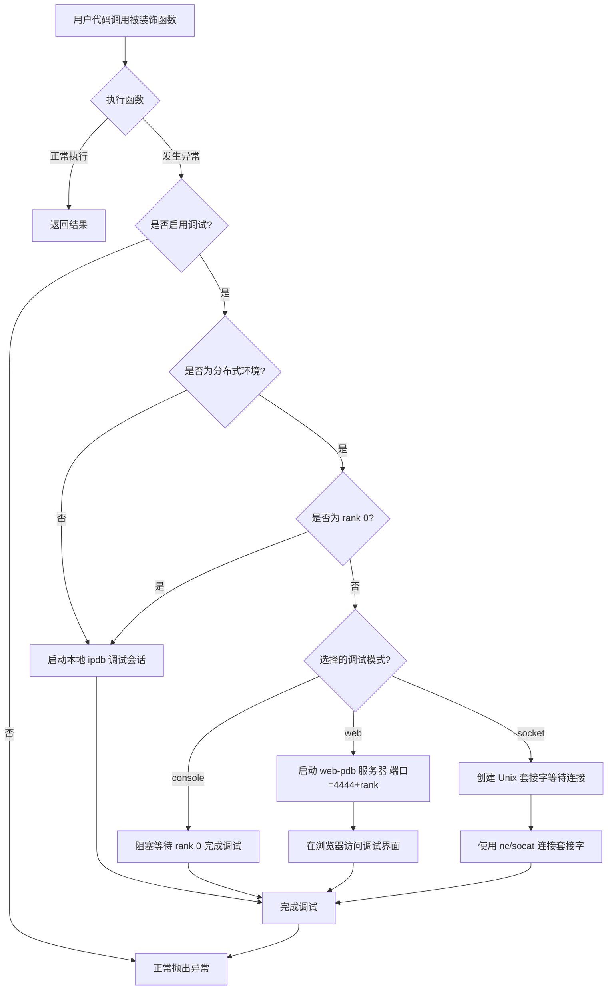
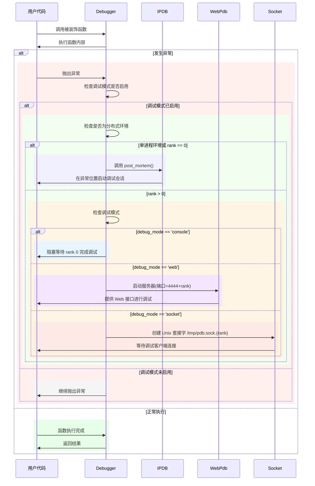

## 工作原理

`py_debug` 工具采用装饰器模式捕获异常，并根据环境提供合适的调试接口。下面通过流程图和时序图来解释其工作原理。

### 1. 异常捕获流程

装饰器 `@Debugger.attach_on_error()` 包装函数，当异常发生时，根据调试标志和运行环境决定如何处理：

### 2. 调试器启动过程

当异常发生并且调试模式已启用时，系统按照以下步骤启动调试器：

