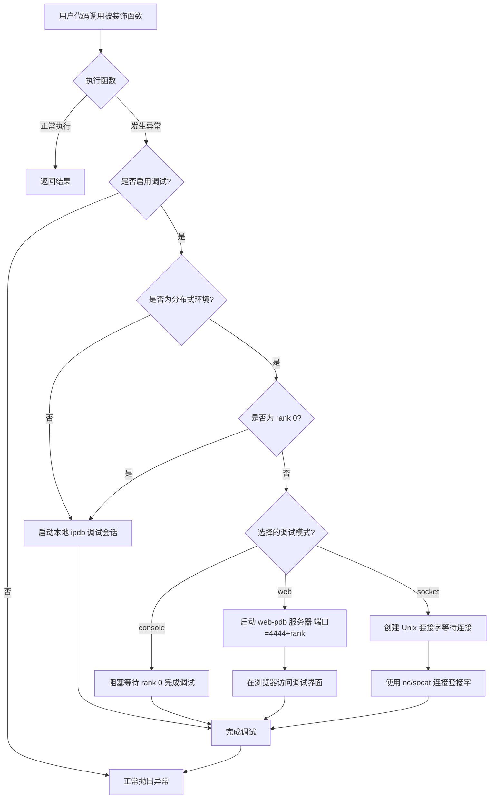
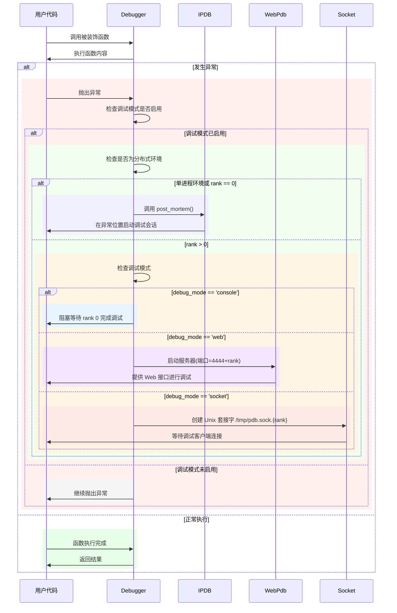

# 🚀 Python Debugging Utilities (`py_debug`)
<p align="right">
    <a href="https://github.com/hhqx/py3_tools/tree/master/examples/py_debug/readme.md">
  
  
  </a>
</p>

**`py_debug`** 是一款为复杂 Python 应用场景设计的轻量级、非侵入式调试工具，尤其适用于分布式与多进程环境。
通过简单的装饰器与环境变量，即可轻松实现自动异常捕获和实时调试。

---

## 🌟 核心功能

* ✅ **自动异常捕获**：使用装饰器 `@Debugger.attach_on_error()` 自动捕获异常。
* 📌 **完整现场保存**：异常时保留完整的调用栈、变量状态与上下文。
* ⚙️ **多进程协调**：智能处理多进程环境下的 `stdin`/`stdout` 冲突。
* 📡 **灵活的调试接口**：提供 Console、Web 和 Socket 三种灵活的调试方式。
* 🧠 **智能环境检测**：自动识别单机或分布式环境，智能选择调试策略。

---

## 📥 安装方式

### 🌐 从 GitHub 源码安装

```shell
git clone https://github.com/hhqx/py3_tools.git
cd py3_tools
pip install -e .[py_debug]
```

### 📦 从 PyPI 安装

```shell
pip install py3_tools_hqx
```

---

## 🎯 快速入门

### 🚩 基础用法（装饰器调试）

将装饰器添加到可能发生异常的函数上，异常发生时自动启动调试器：

```python
# your_script.py
from py3_tools.py_debug import Debugger

@Debugger.attach_on_error()
def risky_operation():
    result = 1 / 0  # 故意制造异常

if __name__ == "__main__":
    risky_operation()
```

**环境变量开启调试：**

```bash
export IPDB_DEBUG=1
export IPDB_MODE=console
python your_script.py
```

### 🖥️ 调试器示例界面：

<details open>
<summary>📌 点击展开日志示例 (Console)</summary>

```log
📌 2023-07-15 10:24:32 | INFO  | Registering `risky_operation` for debug.
❌ 2023-07-15 10:24:32 | ERROR | Exception caught in risky_operation:
Traceback (most recent call last):
  File "/path/py_debug/debug_utils.py", line 273, in debuggable_function_wrapper
    return target_function(*args, **kwargs)
  File "your_script.py", line 6, in risky_operation
    result = 1 / 0
ZeroDivisionError: division by zero

🐞 Entering ipdb debugger...
> your_script.py(6)risky_operation()
      5     # 任何可能抛异常的逻辑
----> 6     result = 1 / 0
      7 

ipdb> p locals()
{'result': <undefined>}
ipdb> q  # 退出调试器
```

</details>


---

### 📡 分布式调试示例（PyTorch 场景）


#### 环境变量说明

| 变量名          | 默认值      | 说明                              |
| ------------ | -------- | ------------------------------- |
| `IPDB_DEBUG` | `0`      | 是否启用调试模式（`1`开启）                 |
| `IPDB_MODE`  | `socket` | 调试模式 (`console`/`web`/`socket`) |

#### 环境变量使用示例：

```bash
export IPDB_DEBUG=1
export IPDB_MODE=web
python your_script.py
```

#### 分布式多进程调试示例：
1. **分布式脚本**：`distributed_example.py`

```python
import torch.distributed as dist
from py3_tools.py_debug import Debugger

dist.init_process_group(backend='gloo')
rank = dist.get_rank()

@Debugger.attach_on_error()
def train_step():
    print(f"Process rank {rank} running train_step()")
    if rank == 1:
        raise RuntimeError("模拟错误发生于进程 rank 1")

if __name__ == '__main__':
    train_step()
```

2. **启动调试**：

```bash
export IPDB_DEBUG=1
export IPDB_MODE=socket
torchrun --nnodes=1 --nproc_per_node=3 distributed_example.py
```

3. **连接 Socket 调试器（Rank 1）**：

```bash
nc -U /tmp/pdb.sock.1
```

<details>
<summary>📌 点击展开 Socket 调试日志示例</summary>

```log
📌 2023-07-15 11:04:23 | ERROR | Exception caught:
RuntimeError: 模拟错误发生于进程 rank 1
📡 Waiting for debugger client on /tmp/pdb.sock.1...
🐞 Debugger connected:

> distributed_example.py(14)train_step()
     13     if rank == 1:
---> 14         raise RuntimeError("模拟错误发生于进程 rank 1")

(rank-1-pdb) p rank
1
(rank-1-pdb) q
```

</details>

---

## 🛠️ 调试模式对比

| 模式          | 适用场景   | 特点              | 访问方式                         |
| ----------- | ------ | --------------- | ---------------------------- |
| **Console** | 单机开发   | Rank0 直接交互，其他阻塞 | 终端                           |
| **Web**     | 远程环境   | 每 Rank 独立端口调试   | `http://host:4444+rank`      |
| **Socket**  | 无GUI环境 | Unix 套接字连接      | `nc -U /tmp/pdb.sock.{rank}` |

---

## 📖 最佳实践

* 开发与测试推荐 `console` 或 `web` 模式
* 生产环境或无 GUI 推荐 `socket` 模式
* 仅装饰关键或复杂函数

```python
from py3_tools.py_debug import Debugger

@Debugger.attach_on_error()
def critical_function():
    ...
```

---


## 🧩 详细工作流程

`py_debug` 工具采用装饰器模式捕获异常，并根据环境提供合适的调试接口。下面通过流程图和时序图来解释其工作原理。

### 1. 异常捕获流程

装饰器 `@Debugger.attach_on_error()` 包装函数，当异常发生时，根据调试标志和运行环境决定如何处理：



### 2. 调试器启动过程

当异常发生并且调试模式已启用时，系统按照以下步骤启动调试器：




---

## 🤝 贡献与反馈

欢迎通过 [GitHub Issues](https://github.com/hhqx/py3_tools/issues) 提交反馈和建议，也欢迎提交 Pull Requests。

---

## 📄 许可证

项目采用 [MIT License](LICENSE)。

---


