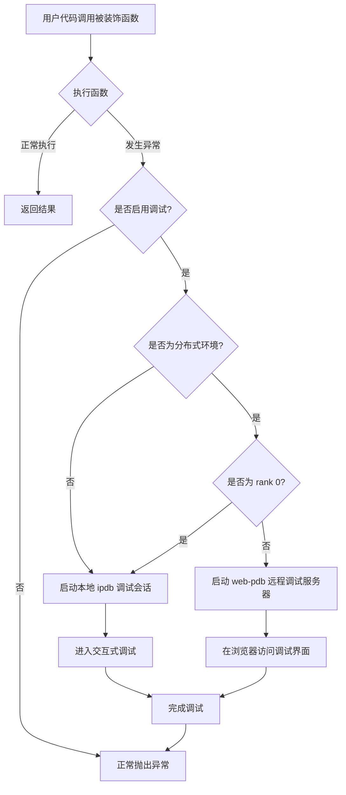
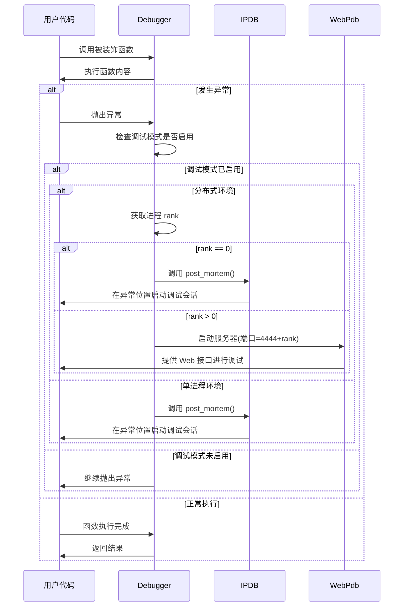

# Python Debugging Utilities

## 核心功能

`py_debug` 是一个的 Python 调试工具，专为解决 Python 应用中的异常捕获与实时调试而设计。它可以：

- **保护异常现场**：在异常发生时，自动捕获并保存完整的调用栈和上下文
- **动态接入调试器**：无需修改代码，通过环境变量动态开启调试模式
- **分布式调试支持**：针对 PyTorch 分布式应用提供特殊支持，区分处理不同 rank 进程
- **简洁易用**：通过简单的装饰器和环境变量，即可接入强大的调试功能

## 使用场景

1. **开发调试阶段**：在开发新功能时，快速定位和排查错误
2. **生产环境故障排查**：通过设置环境变量，临时开启调试模式排查问题
3. **分布式应用调试**：解决多进程分布式应用（如 PyTorch 分布式训练）中的调试难题
4. **远程服务器调试**：使用 Web 调试接口，远程连接到服务器进程进行调试

## Install
```shell
git clone https://github.com/hhqx/py3_tools.git
cd py3_tools
pip install -e .[py_debug]
```

## 快速上手

### 1. 装饰器使用方式

使用 `@Debugger.on_error()` 装饰可能出错的函数，在异常发生时自动进入调试模式：

```python
from py3_tools.py_debug import Debugger

@Debugger.on_error()
def my_function():
    x = 10
    y = 0
    return x / y  # 这里会触发 ZeroDivisionError
```

### 2. 通过环境变量启用调试

无需修改代码，通过环境变量动态控制是否开启调试：

```bash
# 开启调试模式
export IPDB_DEBUG=1

# 运行程序
python your_script.py
```

### 3. 分布式应用调试

在 PyTorch 分布式环境中，不同 rank 使用不同的调试方式：

```python
import torch.distributed as dist
from py3_tools.py_debug import Debugger

dist.init_process_group(backend='nccl')
rank = dist.get_rank()

@Debugger.on_error()
def process_data():
    if rank == 1:
        # rank 1 会触发错误，自动启动 web-pdb
        x = [1, 2, 3][10]  # 索引越界错误
    return "Success"
```

## 详细使用说明

### 单进程调试

装饰任何可能出错的函数，当异常发生并且 `IPDB_DEBUG=1` 时，将自动在异常位置进入 ipdb 调试会话：

```python
from py3_tools.py_debug import Debugger

# 通过命令行参数启用调试
import argparse
parser = argparse.ArgumentParser()
parser.add_argument('--debug', action='store_true')
args = parser.parse_args()
if args.debug:
    Debugger.debug_flag = True

@Debugger.on_error()
def complex_calculation():
    # 一些可能出错的代码
    result = process_data()
    return analyze_result(result)
```

### 分布式 PyTorch 调试

针对分布式训练，系统会自动处理不同 rank 的调试方式：

```python
@Debugger.on_error()
def train_epoch(model, dataloader):
    for batch in dataloader:
        outputs = model(batch)
        loss = compute_loss(outputs)
        loss.backward()
        # 如果这里出现错误:
        # - rank 0 将使用 ipdb 直接在控制台调试
        # - 其他 rank 将启动 web-pdb 服务器，可通过浏览器访问
```

特别说明：对于非 0 rank 的进程，将在端口 `4444+rank` 启动 web-pdb 服务器，您可以通过浏览器访问 `http://hostname:port/` 进行调试。

## 实现细节
1. **异常捕获机制**：
   - 使用装饰器拦截函数执行过程中的异常。
   - 检查调试模式是否开启（环境变量或标志）。
   - 获取异常信息和调用栈，准备调试环境。

2. **调试器启动逻辑**：
   - 单进程：直接使用 `ipdb.post_mortem()` 在异常位置启动交互式调试。
   - 多进程：根据 rank 决定调试方式：
     - rank 0：使用 ipdb 进行控制台调试
     - 其他 rank：启动 web-pdb 服务器，提供 Web 界面调试

3. **环境变量控制**：
   - 通过 `IPDB_DEBUG=1` 开启调试模式。
   - 可通过命令行参数 `--debug` 覆盖环境变量设置。

## 示例脚本
### 单进程调试脚本
[debug_single_process.py](debug_single_process.py): 用于单进程调试。
```shell
export IPDB_DEBUG=1
python debug_single_process.py --mode error
```

### 分布式调试脚本
[debug_multi_torch_rank.py](debug_multi_torch_rank.py): 用于多进程分布式调试。
```shell
export IPDB_DEBUG=1
torchrun --nnodes=1 --nproc_per_node=2 debug_multi_torch_rank.py --fail-rank 1
```

## 注意事项
- **分布式调试**：
  - `rank 0` 使用标准 `ipdb`。
  - 其他 `rank` 启动 `web-pdb` 服务器，端口为 `4444 + rank`。
  - 使用浏览器访问 `http://hostname:port/` 进行调试。
- **环境变量**：
  - 设置 `IPDB_DEBUG=1` 可自动启用调试模式。
  - 使用 `torchrun` 运行分布式脚本时需正确设置 `MASTER_ADDR` 和 `MASTER_PORT`。


## 工作原理

`py_debug` 工具采用装饰器模式捕获异常，并根据环境提供合适的调试接口。下面通过流程图和时序图来解释其工作原理。

### 1. 异常捕获流程

装饰器 `@Debugger.on_error()` 包装函数，当异常发生时，根据调试标志和运行环境决定如何处理：



### 2. 调试器启动过程

当异常发生并且调试模式已启用时，系统按照以下步骤启动调试器：



### 3. 实现机制

- **装饰器模式**: `@Debugger.on_error()` 拦截函数执行并捕获异常
- **环境检测**: 通过环境变量 `IPDB_DEBUG` 或命令行参数 `--debug` 启用调试
- **分布式感知**: 检测 PyTorch 分布式环境并获取当前进程的 rank
- **异常现场保护**: 保留完整调用栈和变量信息，不丢失异常上下文
- **多种调试界面**: 
  - 主进程 (rank 0) 使用标准 ipdb 控制台
  - 其他进程使用 web-pdb 提供 Web 界面，便于远程调试
